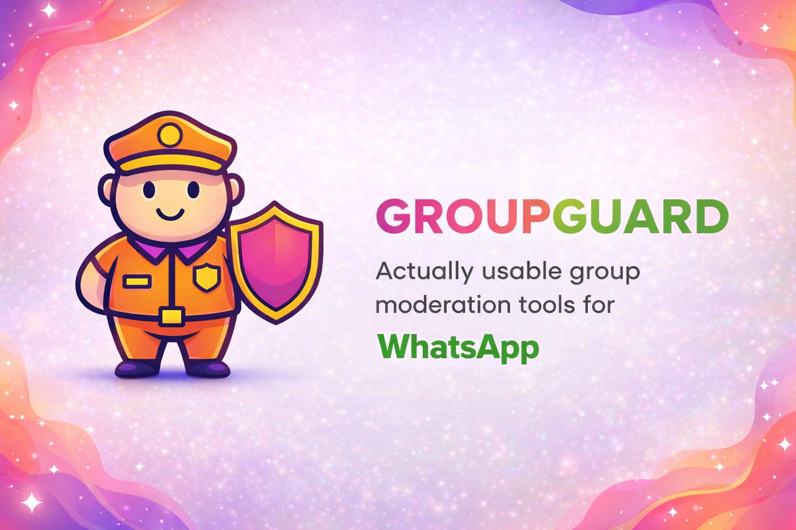

<h1 align="center">GroupGuard</h1>
<p align="center">AI-powered moderation for WhatsApp groups</p>

<p align="center">
  
</p>

<p align="center">
  Proudly powered by <a href="https://github.com/qwibitai/nanoclaw">NanoClaw</a>
</p>

<p align="center">
  <a href="https://groupguard.granot.io">Website</a> &middot;
  <a href="https://chat.whatsapp.com/FjYwJkAZuWlF4jYO12SBoW">Support Group</a> &middot;
  <a href="docs/DEPLOYMENT.md">Deploy</a> &middot;
  <a href="docs/SPEC.md">Docs</a>
</p>

<p align="center">
  <a href="https://chat.whatsapp.com/FjYwJkAZuWlF4jYO12SBoW"></a>
  
  
  
</p>

## Quick Start

```bash
git clone git@github.com:TomGranot/groupguard.git
cd groupguard
./setup.sh
```

Or use Claude Code for guided setup: run `claude` then `/setup`.

**Requirements:** Node.js 20+, Docker, [Claude Code](https://claude.ai/download)

## What It Does

GroupGuard sits in your WhatsApp groups and enforces rules automatically. Beyond moderation, it's a full Claude assistant — it can answer questions, search the web, schedule tasks, and manage files. The moderation runs silently in the background.

```
@GroupGuard enable no-spam and no-links for this group
@GroupGuard set observation mode — log violations but don't delete
@GroupGuard add a keyword filter blocking "crypto" and "forex"
@GroupGuard show moderation stats for the last week
@GroupGuard what's the weather in Tel Aviv?
```

## Guards

14 built-in moderation rules. Each group gets its own configuration — mix and match as needed.

### Content Type Guards

Control what *format* of messages are allowed.

| Guard | What it does |
|-------|-------------|
| `text-only` | Only text messages allowed — blocks images, videos, stickers, voice notes |
| `media-only` | Only media allowed — blocks plain text messages |
| `video-only` | Only video messages allowed |
| `voice-only` | Only voice notes allowed |
| `no-images` | Blocks images and photos |
| `no-stickers` | Blocks stickers |

### Content Property Guards

Filter messages based on their *content*.

| Guard | What it does |
|-------|-------------|
| `no-links` | Blocks any message containing a URL |
| `no-forwarded` | Blocks forwarded messages — only original content allowed |
| `max-text-length` | Blocks messages longer than a limit (default: 2000 characters) |
| `keyword-filter` | Blocks messages matching specific words or regex patterns — configure your own blocklist |

### Behavioral Guards

Rate limiting and access control.

| Guard | What it does |
|-------|-------------|
| `no-spam` | Blocks rapid-fire messages — more than 5 messages in 10 seconds triggers it |
| `slow-mode` | Limits users to one message every N minutes (default: 5) |
| `quiet-hours` | Blocks messages during set hours (default: 10pm–7am) |
| `approved-senders` | Whitelist mode — only approved users can send messages |

All guards are configurable. Defaults are sensible, but you can tune thresholds, time windows, keyword lists, and approved users per group.

### How Enforcement Works

```
Message arrives → Is sender an admin? → Yes: skip (admins are exempt)
                                      → No: run guards
                                              → All pass: message stays
                                              → Guard blocks: delete + DM sender with reason
```

**Observation mode** lets you test rules without deleting — violations get logged but messages stay. **DM cooldown** prevents notification spam (one DM per user per 60 seconds). Everything is logged to SQLite.

## Usage

Talk to your bot with the trigger word (default: `@GroupGuard`):

```
@GroupGuard enable no-spam for this group
@GroupGuard show me the last 10 moderation violations
@GroupGuard schedule a daily summary at 9am
@GroupGuard remind me every Monday to check group stats
```

From the admin channel, you control everything:

```
@GroupGuard list all groups and their guard configs
@GroupGuard enable observation mode for Work Team
@GroupGuard register the "Family Chat" group
```

## Customizing

Tell Claude Code what you want:

- "Add a guard that blocks messages with more than 3 emojis"
- "Change the DM message when a message is blocked"
- "Add a daily moderation report to the admin group"

Or run `/customize` for guided changes. The codebase is small enough that Claude can safely modify it.

## Deploying

Works locally or on a server. See the [deployment guide](docs/DEPLOYMENT.md) for Hetzner, DigitalOcean, and other options starting at $4/month.

## Architecture

Single Node.js process. Guards run on the host for instant enforcement. Agent responses run in isolated Docker containers. Per-group message queues. Full details in [docs/SPEC.md](docs/SPEC.md).

## License

MIT
