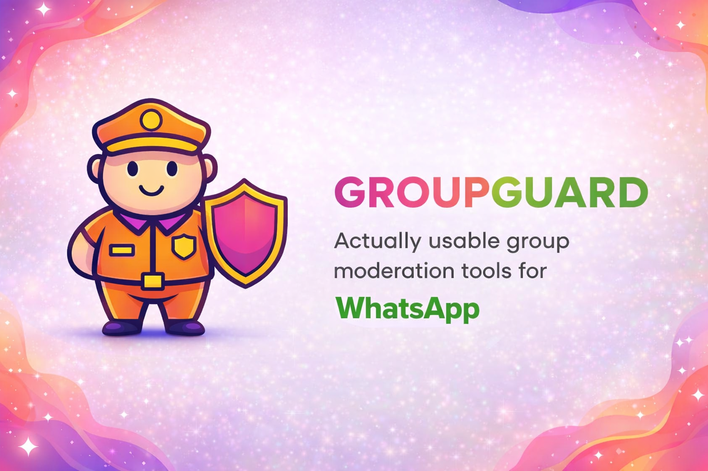

<h1 align="center">GroupGuard</h1>
<p align="center">Safety-first moderation for WhatsApp groups</p>

<p align="center">
  
</p>

<p align="center">
  <a href="https://groupguard.granot.io">Website</a> &middot;
  <a href="docs/PLAYGROUND.md">Playground</a> &middot;
  <a href="docs/SAFE-OPERATIONS.md">Safe operations</a> &middot;
  <a href="docs/DEPLOYMENT.md">Deploy</a> &middot;
  <a href="docs/SPEC.md">Architecture</a>
</p>

GroupGuard watches selected WhatsApp groups, evaluates local rules, and records violations. It starts in observation mode. Deletions require a 24-hour observation period, a per-group setting, and an operator-side lock outside WhatsApp.

The moderation core needs Node.js and a linked WhatsApp account. Docker, Claude, and API credentials are optional.

> [!WARNING]
> GroupGuard uses WhatsApp's unofficial linked-device protocol because Meta's official API does not expose group moderation. WhatsApp may restrict automated accounts. Use a separate number that you can afford to lose.

## Quick start

Requirements: Node.js 20 or newer and a WhatsApp account.

```bash
git clone https://github.com/TomGranot/groupguard.git
cd groupguard
./setup.sh
```

Setup installs pinned dependencies, links WhatsApp, lists your groups, writes conservative settings, builds the app, and runs diagnostics.

Start it in the foreground for the first test:

```bash
npm start
```

Useful commands:

```bash
npm run groups                 # Add groups
npm run doctor                 # Validate auth, config, permissions, and runtime
npm run enforcement -- status # Show each group's mode
npm run playground -- status  # Inspect the public demo profile
npm test                       # Run safety tests
```

## Try before setup

A public **GroupGuard Playground** can make the first product experience a WhatsApp group instead of an installation guide. Visitors run one of four fixed commands, see a simulated guard decision, and can continue to **Protect my group**.

The sealed playground profile requires a dedicated number and installation. It disables AI, enforcement, DMs, and typing indicators; accepts no free-form prompts; rate-limits responses; and deduplicates commands by message ID.

Read [GroupGuard Playground](docs/PLAYGROUND.md) for the welcome copy, deployment steps, safety boundary, and launch checklist.

### Existing installations

Back up `data` and `store`, pull the update, then run `npm ci`, `npm run build`, and `npm run doctor`. The upgrade disables the optional agent and closes the enforcement lock unless `.env` enables them. Existing raw regex filters also need the local `GROUPGUARD_ALLOW_REGEX_FILTERS=true` opt-in.

## Defaults that protect the account

- Observation mode for every new group
- One starter guard: `no-spam`
- No deletion until the operator unlocks enforcement
- No unsolicited moderation DMs
- Admins exempt from guards
- No enforcement when the admin list cannot be verified
- Durable deduplication for moderation actions
- Per-account action budgets and a failure circuit breaker
- Bounded reconnect attempts with exponential backoff and jitter
- AI agent disabled
- Agent project access read-only when the agent is enabled

GroupGuard favors a missed action over repeated or uncertain account mutations.

## Moving from observation to enforcement

Leave a new group in observation mode for at least 24 hours. Review its log before enabling deletions:

```bash
sqlite3 store/messages.db \
  "SELECT timestamp, guard_id, reason FROM moderation_log ORDER BY timestamp DESC LIMIT 50"
```

List folder names, then enable one group:

```bash
npm run enforcement -- status
npm run enforcement -- enable family-chat
```

The command refuses early activation, opens the operator lock in `.env`, and changes only the named group. Restart GroupGuard and verify the result:

```bash
npm run doctor
npm start
```

Return to observation mode at any time:

```bash
npm run enforcement -- disable family-chat
```

Read [Safe Operations](docs/SAFE-OPERATIONS.md) before enabling enforcement.

## Guards

Each group has its own guard list and thresholds.

| Guard | Behavior |
|---|---|
| `no-spam` | Blocks rapid messages above a configured count and window |
| `slow-mode` | Limits each member to one message per interval |
| `quiet-hours` | Blocks messages during configured hours |
| `approved-senders` | Allows only named WhatsApp JIDs |
| `no-links` | Blocks URLs |
| `no-forwarded` | Blocks forwarded messages |
| `max-text-length` | Blocks text above a configured length |
| `keyword-filter` | Blocks configured words; regular expressions require a local opt-in |
| `text-only` | Allows text and blocks media |
| `media-only` | Allows media and blocks plain text |
| `video-only` | Allows video messages |
| `voice-only` | Allows voice notes |
| `no-images` | Blocks images |
| `no-stickers` | Blocks stickers |

Admins remain exempt unless an operator changes that setting. Keep the exemption on for the first enforcement period.

## Optional Claude agent

The agent can answer mentions, schedule tasks, browse the web, and manage group files. It processes untrusted messages, so GroupGuard keeps it off by default.

To enable it:

1. Install and start Docker.
2. Add `ANTHROPIC_API_KEY` or `CLAUDE_CODE_OAUTH_TOKEN` to `.env`.
3. Set `GROUPGUARD_AGENT_ENABLED=true`.
4. Build the agent image with `./container/build.sh`.
5. Run `npm run doctor`.

The main agent receives a read-only project mount. Set `GROUPGUARD_AGENT_PROJECT_WRITE_ENABLED=true` only for a short, supervised maintenance session.

## Where to run it

Use your computer for setup and a short observation test. For 24/7 operation, use a dedicated low-privilege VM with encrypted storage and a service supervisor. Do not run production and test instances against the same `store/auth` directory or WhatsApp number.

Recommended account layout:

| Purpose | Number | Runtime |
|---|---|---|
| Initial test | Separate test number | Your computer, foreground process |
| 24/7 moderation | Dedicated moderation number | Dedicated VM, systemd |
| Development | Another test number | Separate state directory |

See [Deployment](docs/DEPLOYMENT.md) for service setup.

## Architecture

One Node.js process handles the WhatsApp connection, local guards, SQLite audit data, action budgets, and reconnection. Optional agent work runs in ephemeral Docker containers. Each group gets an isolated folder and session.

This keeps the moderation path independent from AI availability and makes the default installation small enough to inspect.

Proposed extension: [Semantic directory assistant](docs/RFC-SEMANTIC-DIRECTORY-ASSISTANT.md), a design for group-scoped service-provider replies with local classification and reviewed recommendation evidence. The RFC contains no implementation.

## License

MIT
